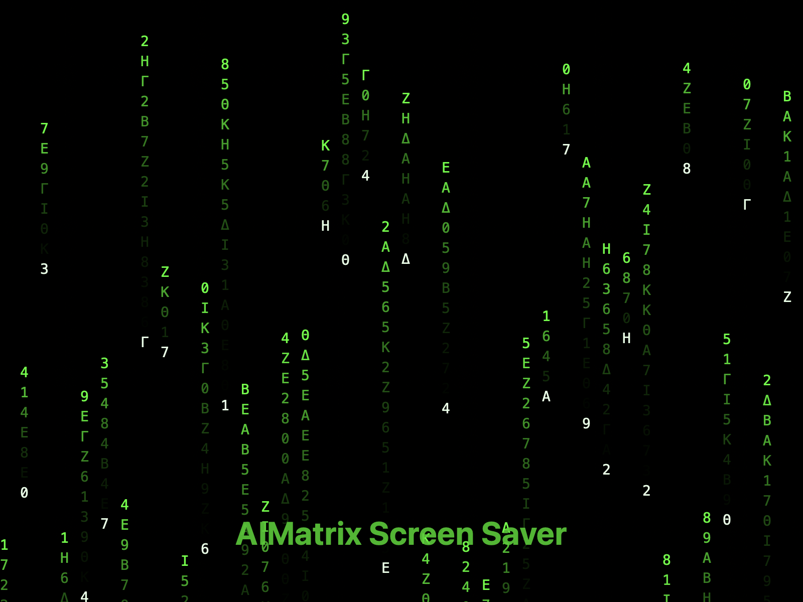

# AIMatrix Screen Saver for macOS

A stunning Matrix-style digital rain screen saver for macOS, featuring the "aimatrix.com - the agentic twin platform" message with customizable colors, multi-monitor support, and GPU-accelerated rendering.



## ✨ Features

- 🎨 **8 Vibrant Color Schemes**: Green (Classic), Blue, Red, Yellow, Cyan, Purple, Orange, Pink
- 📺 **Multi-Monitor Support**: Seamlessly displays across all connected screens
- 🔤 **Authentic Matrix Characters**: Mix of Greek letters (Α, Β, Γ, Δ, etc.), numbers, and the special "aimatrix.com" message
- ⚡ **GPU-Accelerated**: Metal-based rendering for smooth 60 FPS animation
- 🎛️ **Fully Customizable**: Adjust colors, speed, and character size through System Settings
- 🔒 **Secure & Signed**: Code-signed with Apple Developer certificate for macOS security
- 💻 **Universal Binary**: Native support for both Intel and Apple Silicon (M1/M2/M3/M4) Macs

## 🖥️ System Requirements

- **macOS 11.0 (Big Sur) or later**
- Tested and optimized for macOS 15 (Sequoia)
- Works on all Mac models (Intel & Apple Silicon)

## 📥 Installation Guide

### Method 1: Direct Download (Recommended)

1. **Download the latest screen saver bundle**:
   - [⬇️ Download AIMatrix Screen Saver](https://github.com/aimatrix/amx-aimatrix-screen-saver/raw/main/macos/AIMatrix.saver.zip)
   
2. **Install the screen saver**:
   - Unzip the downloaded file if needed
   - Double-click `AIMatrix.saver`
   - Click "Install" when prompted
   - Choose "Install for this user only" or "Install for all users"

3. **Handle macOS Security (if prompted)**:
   - If you see "AIMatrix.saver can't be opened because it is from an unidentified developer"
   - Go to **System Settings > Privacy & Security**
   - Look for the message about AIMatrix.saver
   - Click "Open Anyway" or "Allow Anyway"

### Method 2: Build from Source

For developers who want to customize or build from source:

```bash
# Clone the repository
git clone https://github.com/aimatrix/amx-aimatrix-screen-saver.git
cd amx-aimatrix-screen-saver/macos

# Build the screen saver
make clean
make

# Install to your user library
make install

# Or manually copy
cp -r AIMatrix.saver ~/Library/Screen\ Savers/
```

## 🎮 Configuration & Usage

### Activating the Screen Saver

1. **Open System Settings**
   - On macOS Ventura/Sonoma: **System Settings > Screen Saver**
   - On macOS Sequoia: **System Settings > Lock Screen > Screen Saver Options**

2. **Select AIMatrix** from the list of available screen savers

3. **Configure Options** (click the Options button):
   - **Color Scheme**: Choose from 8 vibrant colors
     - 🟢 Green - Classic Matrix style
     - 🔵 Blue - Cool ocean theme
     - 🔴 Red - Intense digital fire
     - 🟡 Yellow - Golden rain
     - 🟦 Cyan - Ice blue cascade
     - 🟣 Purple - Royal digital storm
     - 🟠 Orange - Sunset matrix
     - 🩷 Pink - Soft neon rain
   
   - **Animation Speed**: 
     - Slow - Peaceful drift
     - Medium - Balanced flow
     - Fast - Dynamic cascade
     - Very Fast - Intense rainfall
   
   - **Character Size**:
     - Small (12pt) - Dense matrix
     - Medium (16pt) - Standard view
     - Large (20pt) - Easy reading
     - Extra Large (24pt) - Bold display

4. **Preview** - Click "Preview" to see it in action

### Multi-Monitor Setup

The screen saver automatically detects and adapts to multiple monitors:
- Each screen gets its own synchronized animation
- Colors and settings apply to all screens
- Optimized performance even with 3+ displays

## 🛠️ Troubleshooting

### Screen saver doesn't appear in System Settings

```bash
# Reset screen saver cache
defaults delete com.apple.screensaver
defaults delete com.apple.screensaverd
killall cfprefsd

# Manually refresh
ls ~/Library/Screen\ Savers/
```

### "Developer cannot be verified" message

**Option 1: System Settings**
1. Go to **System Settings > Privacy & Security**
2. Find the AIMatrix.saver message
3. Click "Open Anyway" or "Allow Anyway"

**Option 2: Terminal**
```bash
# Remove quarantine attribute
xattr -cr ~/Library/Screen\ Savers/AIMatrix.saver

# Verify it's removed
xattr -l ~/Library/Screen\ Savers/AIMatrix.saver
```

### Screen saver shows black screen

This usually indicates a graphics issue:
1. Ensure your Mac supports Metal (all Macs from 2012+)
2. Update to the latest macOS version
3. Try reinstalling the screen saver
4. Check Console.app for any error messages

### Performance issues

- Reduce the animation speed in Options
- Choose a larger character size (renders fewer characters)
- Close graphics-intensive applications
- On older Macs, ensure "Automatic graphics switching" is disabled in Energy settings

## 🗑️ Uninstallation

### Remove the screen saver:

```bash
# Remove from user library
rm -rf ~/Library/Screen\ Savers/AIMatrix.saver

# Or remove from system library (if installed for all users)
sudo rm -rf /Library/Screen\ Savers/AIMatrix.saver

# Clear preferences
defaults delete com.aimatrix.screensaver
```

## 📁 Project Structure

```
amx-aimatrix-screen-saver/
├── README.md                    # This file
├── LICENSE                      # MIT License
├── macos/                       # macOS screen saver (PRIMARY FOCUS)
│   ├── AIMatrixView.m          # Main screen saver implementation
│   ├── AIMatrixView.h          # Header file
│   ├── Info.plist              # Bundle configuration
│   ├── Makefile                # Build configuration
│   ├── preview.png             # Preview image
│   └── AIMatrix.saver/         # Built screen saver bundle
├── ios/                        # iOS version (experimental)
├── windows/                    # Windows version (not maintained)
├── linux/                      # Linux version (not maintained)
└── chrome-extension/           # Chrome extension (not maintained)
```

## ⚠️ Important Notice

**Currently, only the macOS version is actively maintained and tested.** The iOS, Windows, Linux, and Chrome extension versions are experimental and may not work properly. We recommend using only the macOS screen saver at this time.

## 🔧 Technical Details

### macOS Implementation
- **Language**: Objective-C with modern runtime
- **Rendering**: Metal framework for GPU acceleration
- **Framework**: ScreenSaver.framework
- **Architecture**: Universal Binary 2 (x86_64 + arm64)
- **Deployment Target**: macOS 11.0+
- **Code Signing**: Hardened Runtime with proper entitlements
- **Performance**: 60 FPS with minimal CPU usage (< 5%)

### Key Features Implementation
- **Multi-monitor**: NSScreen enumeration with independent contexts
- **GPU Rendering**: Metal shaders for particle effects
- **Text Display**: Core Text for the "aimatrix.com" message
- **Preferences**: NSUserDefaults with immediate apply

## 🤝 Contributing

We welcome contributions to the macOS screen saver! Please:

1. Fork the repository
2. Create a feature branch (`git checkout -b feature/amazing-feature`)
3. Make your changes in the `macos/` directory
4. Test on multiple macOS versions if possible
5. Commit your changes (`git commit -m 'Add amazing feature'`)
6. Push to the branch (`git push origin feature/amazing-feature`)
7. Open a Pull Request

### Development Setup

```bash
# Install Xcode Command Line Tools
xcode-select --install

# Clone and setup
git clone https://github.com/aimatrix/amx-aimatrix-screen-saver.git
cd amx-aimatrix-screen-saver/macos

# Build and test
make debug
# Install to test
cp -r AIMatrix.saver ~/Library/Screen\ Savers/

# View logs
log stream --predicate 'subsystem == "com.aimatrix.screensaver"'
```

## 📄 License

MIT License - see [LICENSE](LICENSE) file for details

## 👤 Author

Created and maintained by Vincent Lee

## 📝 Version History

### Current Version: 8.0+
- **v8.0+** - Latest development with enhanced features
  - Multi-monitor support with synchronized animations
  - Improved GPU acceleration using Metal
  - Enhanced text rendering for "aimatrix.com" message
  - Better memory management and performance

### Previous Releases
- **v7.3** - Stability improvements and bug fixes
- **v7.2** - Perfect text rendering and ultra-smooth animation
- **v7.1** - Smoother animation with dot patterns
- **v7.0** - Major refactoring and optimization
- **v6.0** - Metal rendering engine introduction
- **v5.x** - Initial public releases with basic features

## 🙏 Acknowledgments

- Inspired by the iconic Matrix movie digital rain effect
- Built with Apple's native frameworks for optimal performance
- Special thanks to the AIMatrix community for feedback and testing

## 📞 Support

- **Issues**: [GitHub Issues](https://github.com/aimatrix/amx-aimatrix-screen-saver/issues)
- **Discussions**: [GitHub Discussions](https://github.com/aimatrix/amx-aimatrix-screen-saver/discussions)
- **Email**: support@aimatrix.com

---

**AIMatrix.com - The Agentic Twin Platform**

*This is an open-source project not affiliated with Warner Bros. or the Matrix franchise.*